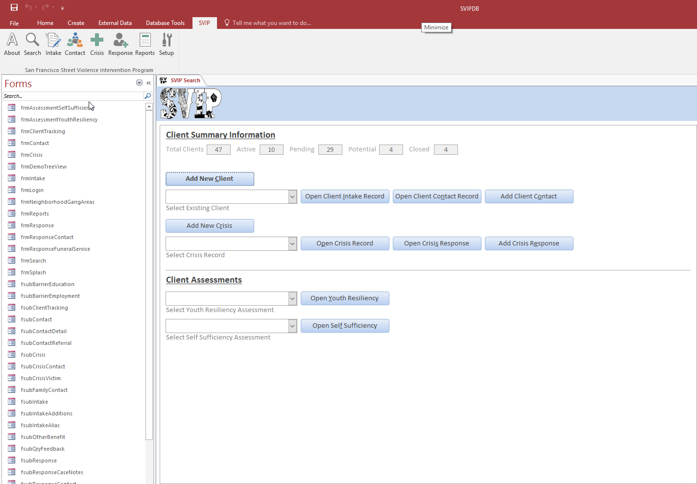
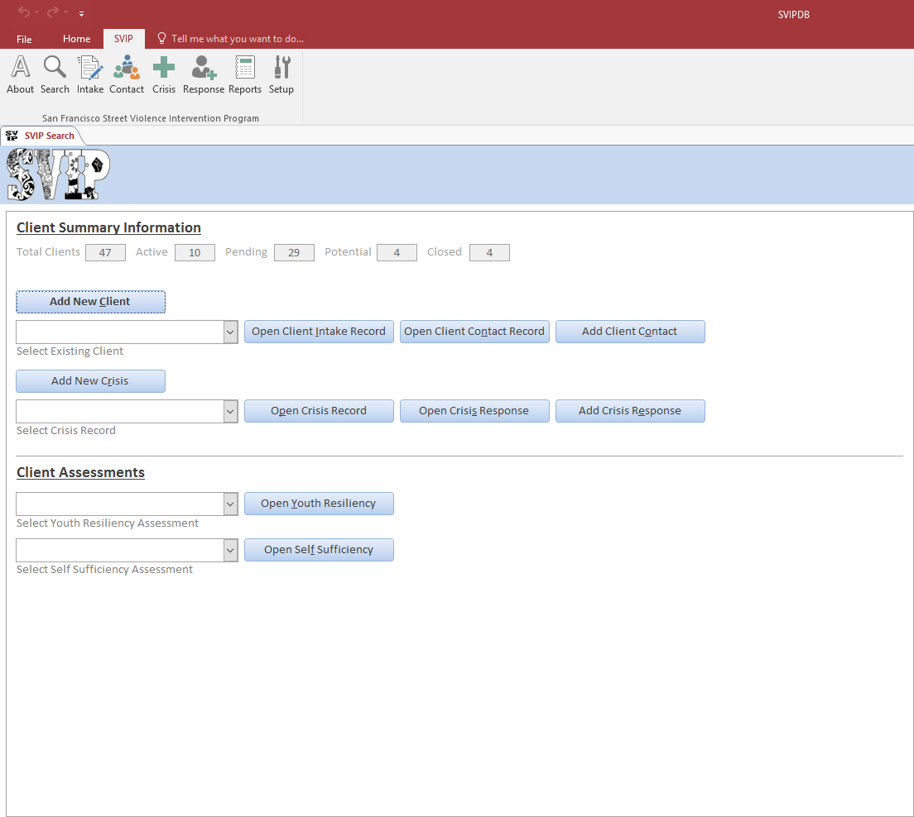

<!--  -->

# Main page

* Clicking on 
 
will take you to the 
[Intake Form](/IntakeForm/intakeform.md) 

* Clicking on 
 
 will take you to the 
[Contact Form](https://kinsidar.github.io/Association-Contacts/docs/ContactForm/ContactForm.html) 

* Clicking on 
 
 will take you to the 
[Crisis Form](https://kinsidar.github.io/Association-Contacts/docs/CrisisForm/CrisisForm.html) 

* Clicking on 
 
 will take you to the 
[Response Form](https://kinsidar.github.io/Association-Contacts/docs/ResponseForm/ResponseForm.html)

* Clicking on 
 
 will take you to the 
[Open Youth Resiliency](https://kinsidar.github.io/Association-Contacts/docs/ReportsDirectory/ReportsDirectory.html) 

* Clicking on 
 
 will take you to the 
[Open Self Sufficiency](https://kinsidar.github.io/Association-Contacts/docs/ReportsDirectory/ReportsDirectory.html) 

* Clicking on 
 
 will take you to the 
[Reports Directory](https://kinsidar.github.io/Association-Contacts/docs/ReportsDirectory/ReportsDirectory.html) 

<!-- for sizing images -->
<!--  -->